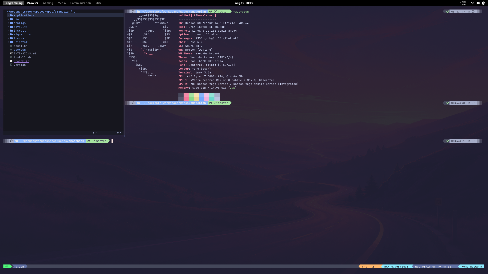
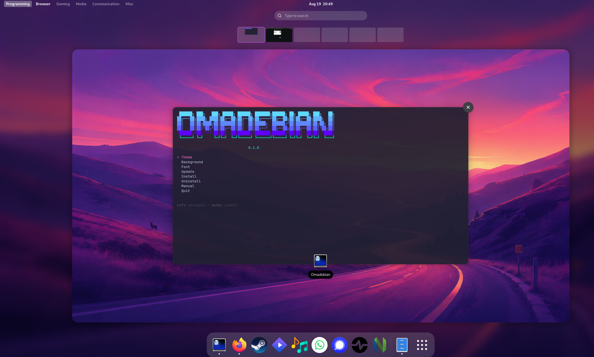
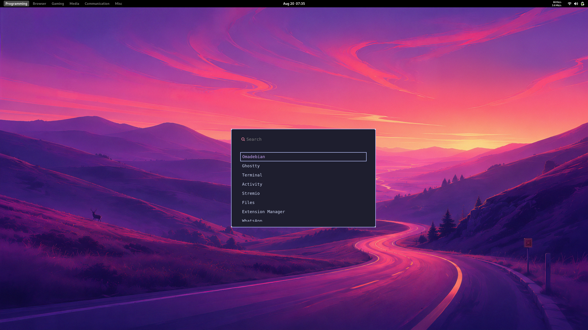

# Omadebian

Omadebian is a fork of Omakub introduced my DHH, it takes the same principle and adapts it to Debian, turning an existing Debian
experience into a wonderfully configured system.

Screenshots:

There are some differences between the original Omakub and Omadebian, namely the original Debian hotkeys are kept intact, tmux instead of zellij and ghostty instead of alacritty.
That's about it.

For more info check out the original [https://omakub.org/](https://omakub.org/)

## Contributing to the documentation

Please help us improve Omakub's documentation on the [basecamp/omakub-site repository](https://github.com/basecamp/omakub-site).

## License

Omadeb is released under the [MIT License](https://opensource.org/licenses/MIT).

## Extras

While omadeb is purposed to be an opinionated take, the open source community offers alternative customization, add-ons, extras, that you can use to adjust, replace or enrich your experience.

[⇒ Browse the omakub extensions.](EXTENSIONS.md)
